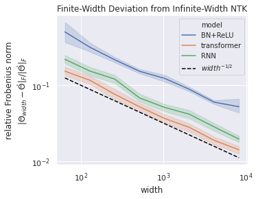

# Infinite-Width Neural Networks for Any Architecture: Reference Implementations

This repo is a companion to the paper

[**Tensor Programs II: Neural Tangent Kernel for Any Architecture**](https://arxiv.org/abs/2006.14548) 
*Greg Yang*

which shows that the *infinite-width limit* of a neural network of any architecture is well-defined (in the technical sense that the [tangent kernel (NTK)](https://arxiv.org/abs/1806.07572) of any randomly initialized neural network converges in the large width limit) and can be computed.
We explicitly compute several such infinite-width networks in this repo.

Despite what the title suggests, this repo does not implement the infinite-width NTK for every architecture, but rather demonstrates the derivation and implementation for a few select advanced architectures.
For more basic NTK like multi-layer perceptron or vanilla convolutional neural network, see [neural-tangents](https://github.com/google/neural-tangents).

*Note: Currently Github does not render the notebooks properly. We recommend opening them up in Google Colab.*

Architecture        | Notebook                     | Colab
--------------------|------------------------------|-------
RNN with avg pooling| [Notebook](RNN-NTK.ipynb)        |  
Transformer         | [Notebook](Transformer-NTK.ipynb)| 
Batchnorm+ReLU MLP  | [Notebook](Batchnorm-NTK.ipynb)  | 

[Plot.ipynb](Plot.ipynb) also reproduces Figure 1 of the paper.

Related: a wide neural network of any architecture is distributed like a Gaussian process, as proved in the [previous paper of this series](https://arxiv.org/abs/1910.12478). Derivations and implementations of this Gaussian process for RNN, transformer, batchnorm, and GRU are provided in [here](https://github.com/thegregyang/GP4A).
